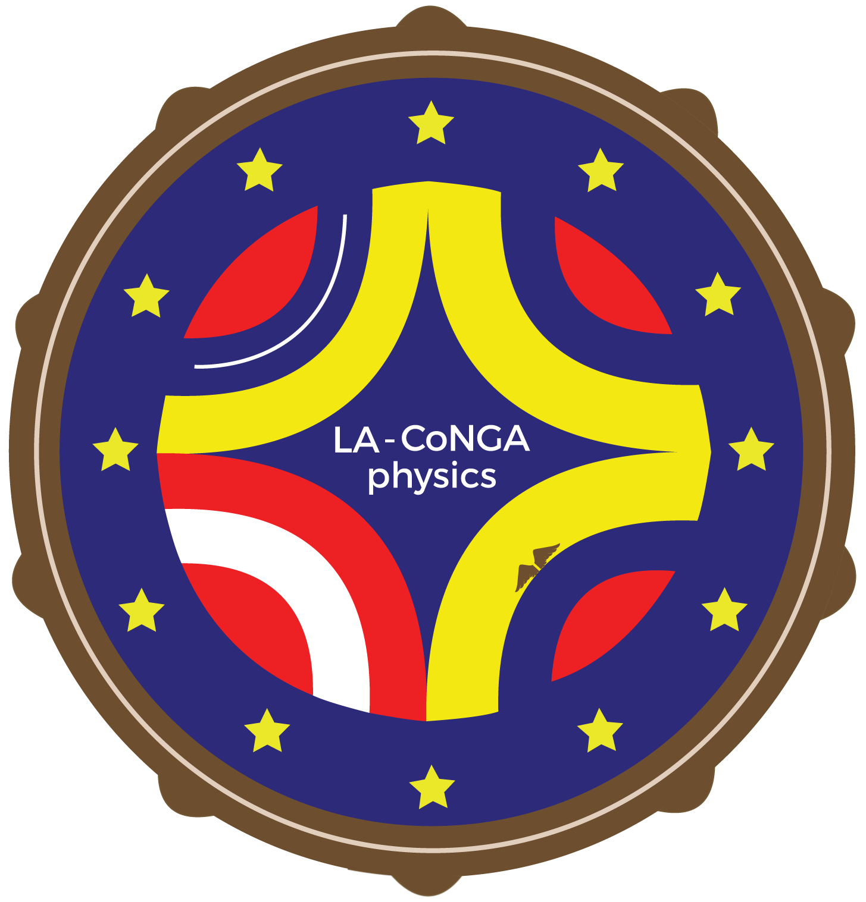

<!-- ALL-CONTRIBUTORS-BADGE:START - Do not remove or modify this section -->

<!-- ALL-CONTRIBUTORS-BADGE:END -->
  

  **LA-CoNGA physics (Latin American alliance for Capacity buildNG in Advanced physics)**

<!--

-->

<!--
**_This README.md file in also available in Spanish ([README-Spanish]())_**
-->

First and foremost, Welcome! 🎉 Te damos la bienvenida 🎊 :partying_face:!

Thank you for visiting LA-CoNGA physics repository.

Jump straight to one of the sections below, or just scroll down to find out more.

Table of contents:

- [About LA-CoNGA physics](#About-the-project)
  - [What are we doing?](#What-are-we-doing?)
  - [Why are we doing it?](#Why-are-we-doing-it?)
- [The team](#the-team)
- [Do you want to contribute?](#do-you-want-to-contribute?)
  - [Get in touch](#get-in-touch)
- [Citing _LA-CoNGA physics_](#citing-LA-CoNGA-physics)

## About the project

### What are we doing?

_LA-CoNGA Physics_ is an [Erasmus+ Capacity Building](https://ec.europa.eu/programmes/erasmus-plus/opportunities/organisations/innovation-good-practices/capacity-building-higher-education_en) project, an European-Latinamerican network which aims to support the modernization of the university infrastructure and the pedagogical offer in advanced physics in four Latin American countries: Colombia, Ecuador, Peru and Venezuela. This virtual teaching and research network is composed of 3 partner universities in Europe and 8 in Latin America, high-level scientific partners (CEA, CERN, CNRS, DESY, ICTP), and several academic and industrial partners (including redCLARA, CAEN, among others). The project is co-funded by the Education, Audiovisual and Culture Executive Agency (EACEA) of the European Commission. _LA-CoNGA physics_ started officially in January 2020 and has an initial funding for 3 years.

In practice _LA-CoNGA physics_ has created a set of postgraduate courses in Advanced Physics (high energy physics and complex systems) that are common and inter-institutional, supported by the installation of interconnected instrumentation laboratories and an open e-learning platform. This program is inserted as a specialization in the Physics masters of the 8 Latinamerican partners in Colombia, Ecuador, Peru and Venezuela. It is based on three pillars: courses in physics theory/phenomenology, data science and instrumentation.

More information can be found at: https://laconga.redclara.net

### Why are we doing it?

STEM master programs in most of Latinamerica focus on the scientific theoretical aspects, with little formal training in data science and instrumentation so needed in today’s world inside and outside academia. In this sense _LA-CoNGA physics_ ’ pedagogical offer is a first of its kind in the region. In addition, working in a network configuration allows to combine the technical and personpower resources from the institutions to create such a pedagogical offer. Together we are stronger.

We are guided by the principles of open science and open education. The development of robust, open research in our partner institutions could have global benefits and global collaborations like _LA-CoNGA physics_ would increase their access to resources that might currently be off limits. We want to:
* Promote open science values such as reproducibility, transparency and openness in the partner universities
* Create a dynamic and international community trained in open science principles and advocate for them

## LA-CoNGA physics mission and vision

_LA-CoNGA physics_ mission is the creation of a Latin-American-European Virtual Research and Learning Community in the field of Advanced Physics to promote the values of collaboration, open education and open research in institutes from Colombia, Ecuador, Peru and Venezuela. We will train a new generation of scientists in Latin-America through a one-year master level specialization program that focuses on three pillars of knowledge: theoretical physics, instrumentation in experimental design and data science. We will build a diverse collaborative network that allows the students to access tools, equipment, and know-how that would otherwise not be available.

## The team

[_LA-CoNGA physics_ network](https://laconga.redclara.net/our-partners/) is composed of 11 universities, 9 research institutions and 3 industrial partners in advanced physics:
- Universidad Antonio Nariño (UAN) :colombia:
- Universidad Industrial De Santander (UIS) :colombia:
- Universidad San Francisco De Quito (USFQ) :ecuador:
- Universidad De Investigación De Tecnología Experimental Yachay (YACHAY TECH) :ecuador:
- Universidad Nacional De Ingeniería (UNI) :peru:
- Universidad Nacional Mayor De San Marcos (UNMSM) :peru:
- Universidad Central De Venezuela (UCV) :venezuela:
- Universidad Simón Bolívar (USB) :venezuela:
- Université De Paris :fr:
- University Paul Sabatier, Toulouse Iii (UPS) :fr:
- Technische Universitaet Dresden (TUD) :de:
- Centre National De La Recherche Scientifique (CNRS) :fr:
- CERN :switzerland:
- DESY :de:
- ICTP (Trieste) :it:
- IRFU (Francia) :fr:
- RedCLARA

Thanks goes to these wonderful people ([emoji key](https://allcontributors.org/docs/en/emoji-key)):
Do we want to add the contributors list?? Yes

## Do you want to contribute?

:construction: This project is a work in progress and we are always looking for motivated people to help us build something that is useful for our students :construction:

We need experts (researchers and teachers) in the Advanced physics for curricula design, in interconnected instrumentation, in data management (particularly ensuring the highest quality data protection plans are in place), in communication, in fundraising, app development, user experience design and documentation.

If you think you can help in any of the areas listed above (and we bet you can) or in any of the many areas that we haven't yet thought of (and here we're sure you can) then please contact our project manager **Andrea Grijalva** by email at [contacto@laconga.redclara.net](mailto:contacto@laconga.redclara.net)

Please note that it's very important to us that we maintain a positive, open, safe and supportive learning environment for everyone who wants to participate. When you join us we ask that you follow our [code of conduct](CODE_OF_CONDUCT.md) in all interactions both on and offline.

### Get in touch

You can contact our project manager **Andrea Grijalva** by email at [contacto@laconga.redclara.net](mailto:contacto@laconga.redclara.net). You can follow also the project in our social networks:
There are many ways to get in touch with _LA-CoNGA Physics_ team!

- Follow us for regular updates on our social networks
  - [@lacongaphysics](https://twitter.com/lacongaphysics) on Twitter
  - [@lacongaphysics](https://www.facebook.com/lacongaphysics) on Facebook
  - [@lacongaphysics](https://www.instagram.com/lacongaphysics/) on Instagram  
  - [Youtube Channel](https://www.youtube.com/channel/UCcXSolYkpCW_iYxHrnSJw0w)

## Citing _LA-CoNGA Physics_ <!--es necesario???-->

For now we do not have anything. To be added later. Define granularity

We really appreciate any references that you make to LA-CoNGA Physics project and we hope it is useful. If you have any questions please [get in touch.](#Get-in-touch)

## Thank you

Thank you so much (Gracias :smiling_face_with_three_hearts:!) for visiting the project and we do hope that you'll join us on this amazing journey to .

## Contributors ✨

Thanks goes to these wonderful people ([emoji key](https://allcontributors.org/docs/en/emoji-key)):

<!-- ALL-CONTRIBUTORS-LIST:START - Do not remove or modify this section -->
<!-- prettier-ignore-start -->
<!-- markdownlint-disable -->
<table>
  <tr>
    <td align="center"><a href="https://twitter.com/mxrtinez"> <b>Alexander Martínez Méndez</b></a> <a href="https://github.com/LA-CoNGA/OLS/commits?author=mxrtinez" title="Code">💻</a> <a href="#content-mxrtinez" title="Content">🖋</a> <a href="https://github.com/LA-CoNGA/OLS/commits?author=mxrtinez" title="Documentation">📖</a> <a href="#ideas-mxrtinez" title="Ideas, Planning, & Feedback">🤔</a> <a href="#maintenance-mxrtinez" title="Maintenance">🚧</a> <a href="#platform-mxrtinez" title="Packaging/porting to new platform">📦</a></td>
  </tr>
</table>

<!-- markdownlint-restore -->
<!-- prettier-ignore-end -->

<!-- ALL-CONTRIBUTORS-LIST:END -->

This project follows the [all-contributors](https://github.com/all-contributors/all-contributors) specification. Contributions of any kind welcome!