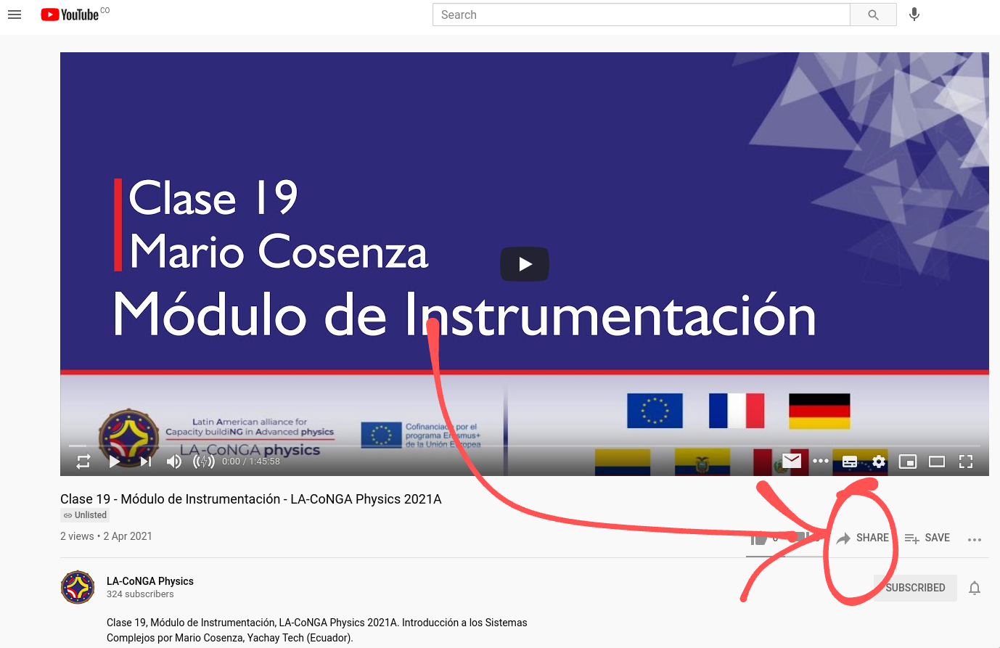
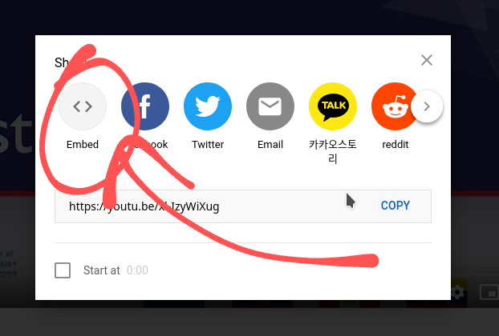
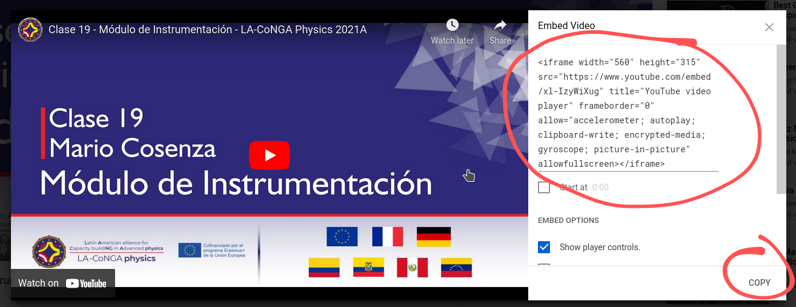
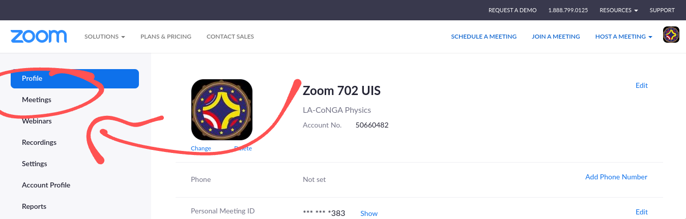
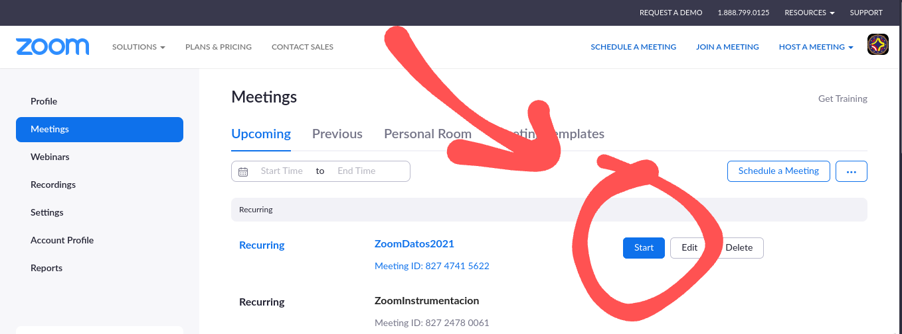
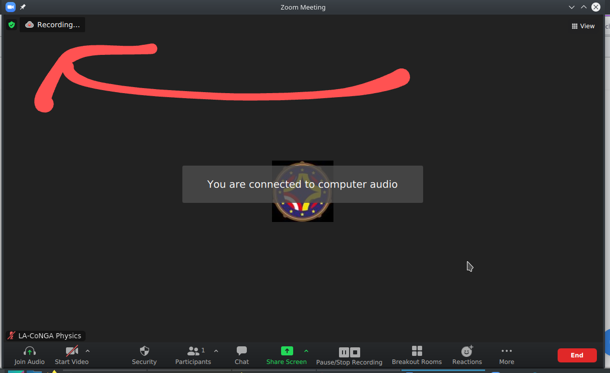

# LA-CoNGA Physics LCMS service

The material for the _LA-CoNGA Physics_ module classes is created and preserved by an _LCMS-like_ service (Learning Content Management Service) called _LA_CoNGA Physics Courses_. This service uses the framework [_MkDocs_](https://www.mkdocs.org/) to build a web page. The creation and editing of the educational content for the classes is done collaboratively from the [LA-CoNGA Courses](https://gitmilab.redclara.net/tutoriales/tutorial-mkdocs) repository and hosted in the [GitLab service](gitmilab.redclara.net/). The resulting web page can be viewed in [laconga.redclara.net/courses/](laconga.redclara.net/courses/)

## _LA_CoNGA Physics Courses_ guides

Below you will find some guides to the process for documenting a class on this service and other activities.

- [How to add Youtube videos in _Markdown_](#youtube-videos-in-markdown)
- [Online Classes With Zoom](#Online-Classes-With-Zoom)

### Youtube Videos in markdown

To add _Youtube_ videos to a _Markdown_ file follow the next steps.

1. Go to the _Youtube_ video. For example [Clase 19 - módulo de isntrumentación](https://www.youtube.com/watch?v=xl-IzyWiXug)
1. Click on __Compartir/Share__ as the image shows.

1. Click in __embed__.

1. Click in __COPY__ or copy all _iframe_ code in the right side.

1. Paste the copied code in the markdown file in the place where we want to see the video.
1. Save changes in the _Markdown_ file.
1. That's all folks

### Online Classes With Zoom

Laconga classes are held with the zoom video communications platform. Instructions for taking a class are given below.

- Go to https://zoom.us and authenticate with the username `zoom702@uis.edu.co`. You must make sure that you are logging in with this user and not your personal user.
- Click on __Meetings__ in the left panel.

- Find the meeting scheduled for the module and click __Start__.
  

  >At this point you can choose whether to use the desktop application (if installed) or use the browser for the video call. It is recommended to use the desktop application.

- Once the video call has started, it is important to check that it is being recorded, we can see this in the upper left corner of the application or the browser with a __Recording message ...__

- Students will first enter a waiting room, click Admit on the displayed message to enter the video call or go to the participant list and click the Admit button on the right side of the name.
- When the class finish click __End meeting__ in the bottom left corner and then click on __End meeting for all__
